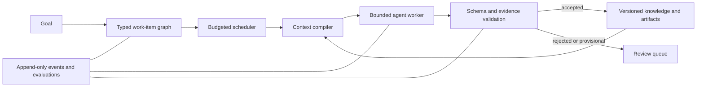

# Multi-agent systems and data ontology — Factor project section

Status: design and staged implementation plan. Factor currently runs one bounded agent per scientific request; it does not yet claim a distributed multi-agent runtime.

## Why this belongs in Factor

Factor already separates requests, policies, actions, artifacts, evidence, evaluations, and decisions. A larger agent system should extend those boundaries instead of replacing them with unrestricted agent-to-agent chat. The governing design is:

> Agents execute bounded, typed work. Durable shared memory lives in versioned data objects outside model context. Only validated outputs enter accepted project knowledge.

The full platform-neutral architecture and implementation reference is [Multi-Agent Frameworks and Ontologies](MULTI_AGENT_FRAMEWORKS_AND_ONTOLOGIES.md). The starter machine-readable vocabulary is in [`ontology/factor-core.schema.json`](ontology/factor-core.schema.json).

## Why structure, tags, and provenance affect AI quality

An LLM can only reason over the information placed in its finite context, and a training run can only learn from the examples selected and labeled for it. Organized data improves both paths:

| Data property | Inference and retrieval effect | Training and evaluation effect |
| --- | --- | --- |
| Stable identity | Deduplicates entities and retrieves the intended object | Prevents duplicate or conflicting examples from silently crossing splits |
| Typed objects and relations | Lets context builders distinguish observations, claims, evidence, decisions, and policies | Enables task-specific sampling, labels, metrics, and error analysis |
| Domain and sensitivity tags | Narrows retrieval and enforces access boundaries before prompting | Supports representative slices and prevents restricted data from entering a dataset |
| Provenance and derivation | Preserves the path from model-visible statements to sources and calculations | Allows exclusion of synthetic, generated, stale, or weakly governed examples |
| Schema and ontology versions | Makes a context packet replayable | Ties weights, datasets, and scores to the meanings used at training time |
| Validity and supersession | Avoids presenting obsolete facts as current | Supports temporal splits and identifies label drift |
| Confidence and verification state | Keeps uncertainty and disagreement visible | Enables calibrated targets and separate scoring of provisional versus accepted knowledge |
| Content hashes | Detects changed inputs and artifacts | Makes dataset and evaluation manifests reproducible |

These properties do not make a model correct by themselves. They make the input set inspectable, retrievable, filterable, reproducible, and measurable. Factor should test the resulting quality gain against an unstructured baseline rather than assume it.

## Factor architecture extension

The planner may propose work, but the scheduler owns admission, concurrency, cost, and delegation limits. Workers exchange references to typed artifacts and claims through the task ledger. Canonical knowledge has a controlled commit path.

## Mapping to the current repository

| Ontology concept | Existing Factor foundation | Required extension |
| --- | --- | --- |
| `WorkItem` | `RunRequest` and bounded runtime actions | Stable task ledger, dependencies, leases, retries, and parent goals |
| `Agent` | conventional, local, and cloud providers under runtime policy | Versioned capability profiles and worker identities |
| `Artifact` | content-addressed run artifacts | Cross-run registry, lifecycle, security tags, and derivation links |
| `Claim` | hypotheses and final conditional explanations | Atomic claim store with support, refutation, validity, and review state |
| `Observation` | validated motion observations | Stable observation identity and domain modules |
| `Decision` | structured final decision | Decision authority, supersession, and downstream dependency links |
| `Evaluation` | frozen suites, separated truth, candidate scoring | Evaluation objects linked to exact agents, contexts, claims, and datasets |
| `ContextManifest` | run manifest and model-visible context | Exact versioned item list plus selection rules and exclusion audit |
| `Policy` | `RuntimePolicy` | Data-level permissions, cohort budgets, delegation depth, and commit authority |
| `Event` | run event chain | Cross-run event ledger with replay and workflow state projections |

## Ontology kernel

Factor begins with three connected layers:

1. Domain: `Concept` and `Observation`, extended later by versioned scientific modules.
2. Work: `Goal`, `WorkItem`, `Agent`, `Tool`, `Artifact`, `Decision`, `Evaluation`, `ContextManifest`, `Procedure`, and `Policy`.
3. Provenance: `Source`, `Event`, creators, timestamps, content hashes, derivation, and supersession.

Every durable object carries a common envelope: stable ID, type, schema and ontology versions, project, tags, security classification, creator, timestamps, version, verification state, and optional content hash. Relationships are typed and may point to a specific object version. An artifact is not a claim, a generated claim is not accepted truth, and a recommendation is not an authorized decision.

Initial competency questions are:

1. Which exact sources and artifacts support or refute a claim?
2. Which model, policy, tools, and object versions were visible for an agent attempt?
3. Which tasks, evaluations, and decisions depend on an assumption?
4. Which dataset examples were derived from model-generated content or superseded evidence?
5. What must be reviewed when a claim, schema, or ontology term changes?

## Large-framework operating model

Scale refers to logical work items, not unconstrained simultaneous model calls. Factor should use dependency graphs, bounded worker pools, creator-validator stages, and hierarchical cohorts only after simpler patterns are measured. Ten thousand logical tasks may mostly be queued, blocked, awaiting review, or complete.

Shared-state rules:

- Agents receive immutable, task-specific context manifests.
- Agent inputs and outputs are schema validated.
- Retrieved documents are untrusted data, never executable instructions.
- Claims preserve support, contradiction, uncertainty, and provenance.
- Multiple workers may propose changes; one governed service commits canonical state.
- Model and tool concurrency, cost, time, permissions, and delegation depth are bounded.
- Every attempt remains replayable even when its output is rejected.

## Staged implementation and evaluation

### Stage 0 — now

- Preserve the reference architecture in the repository.
- Publish a versioned ontology kernel and example object.
- Explore the contracts in [lesson 15 — bounded multi-agent coordination](../notebooks/15_multi_agent_coordination_lab.ipynb) and [lesson 16 — ontology, provenance, and better model context](../notebooks/16_data_ontology_and_provenance_lab.ipynb).
- Keep current single-agent behavior unchanged.

### Stage 1 — typed knowledge

- Add validated Python models matching the ontology kernel.
- Promote selected run artifacts into cross-run `Source`, `Artifact`, `Claim`, and `Evaluation` records.
- Compile an immutable context manifest from explicit object IDs.

Acceptance gate: the same manifest reproduces the same authorized input set, and invalid provenance or type relationships are rejected.

### Stage 2 — coordinated agents

- Add a durable work-item ledger with dependencies, leases, idempotency keys, and bounded retries.
- Exercise a creator-validator workflow with two or three roles.
- Keep a single controlled knowledge-commit path.

Acceptance gate: injected duplicate delivery, worker failure, contradiction, and budget exhaustion leave consistent ledger and artifact state.

### Stage 3 — measure data organization

Compare identical models and token budgets under:

1. unstructured document retrieval;
2. tagged retrieval;
3. typed claim/evidence retrieval with provenance and validity filters.

Measure retrieval precision and recall, citation validity, unsupported-claim rate, decision accuracy and calibration, context tokens, latency, cost, and performance by data slice. For training, freeze content hashes and split rules; measure label conflicts, duplicate leakage, provenance-class accuracy, held-out task quality, and regressions.

Acceptance gate: expand only if structured data produces a repeatable improvement or a clearly documented governance benefit that justifies its cost.

## Boundaries

- This section defines an architecture and ontology kernel; it is not evidence that Factor already operates a large fleet.
- A JSON Schema is a portable validation contract, not a complete database, scheduler, or ontology service.
- Tags complement typed relations; they must not replace stable identity, evidence links, or authorization.
- Provenance records origin and transformation. It does not establish that a source or claim is scientifically correct.
- Vector similarity may help retrieval, but it is not the source of truth and cannot represent authority, validity, or task dependencies by itself.
